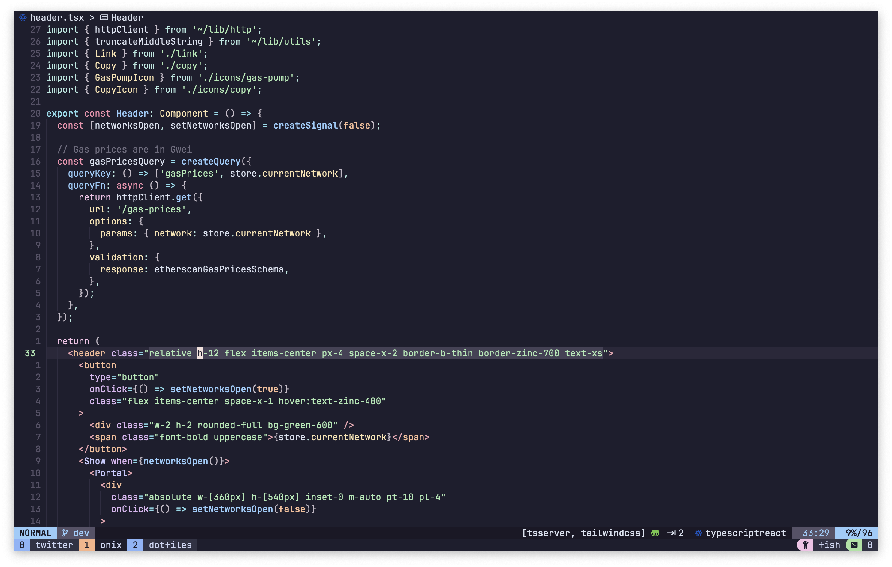
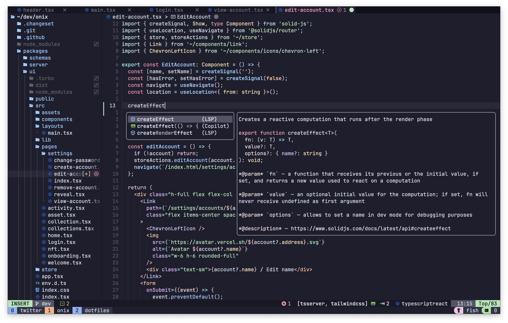
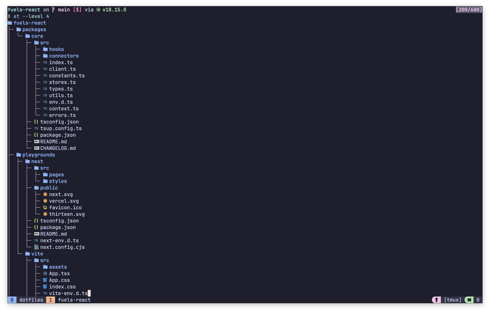
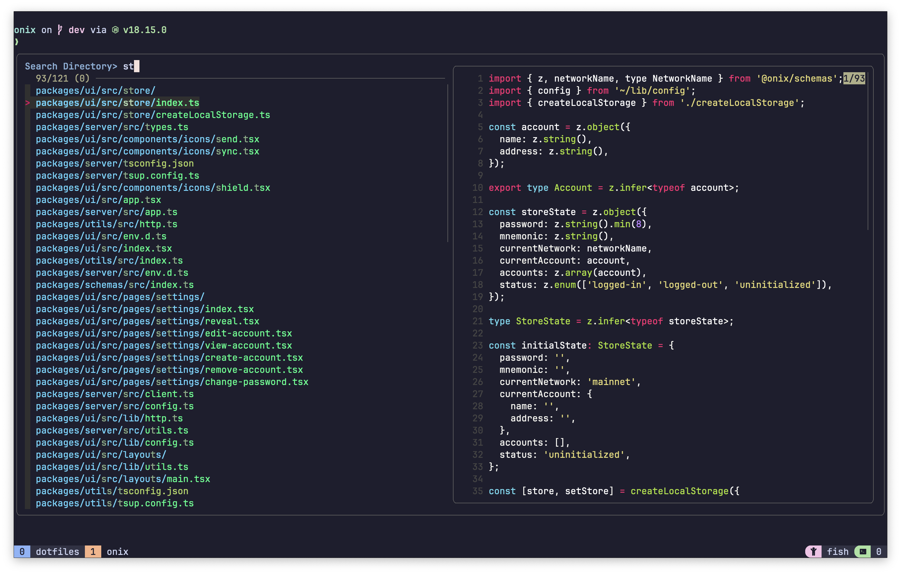

# My dotfiles

> **Warning**
> Don't blindly use this config, it works on my machine but it might not work on yours.

## Setup

Set `fish` as login shell then log back in.

```sh
$ chsh -s $(which fish)
```

## Requirements

| CLI         | Minimum version required | Description                                |
| ----------- | ------------------------ | ------------------------------------------ |
| [exa]       | 0.10.0                   | Modern replacement for `ls`                |
| [erdtree]   | 1.7.0                    | Faster and colorized `tree`                |
| [bat]       | 0.16.0                   | Smarter `cat` with syntax highlighting     |
| [ripgrep]   | 13.0.0                   | Faster alternative to `grep`               |
| [fd]        | 8.7.0                    | Faster and colorized alternative to `find` |
| [fzf]       | 0.39.0                   | Command-line fuzzy finder                  |
| [lazygit]   | 0.37.0                   | TUI for git                                |
| [neovim]    | 0.9.0                    | Modern vim                                 |
| [tmux]      | 3.3a                     | Terminal multiplexer                       |
| [zoxide]    | 0.9.0                    | Smarter `cd` command                       |
| [fish]      | 3.6.0                    | User-friendly command line shell           |
| [starship]  | 1.31.0                   | Minimal, Fast and customizable prompt      |

## Screenshots

### Neovim

The neovim config is based on [LunarVim](https://github.com/LunarVim/LunarVim) with a couple additional plugins.





### Lazygit


### Tree



### FZF



[exa]: https://github.com/ogham/exa
[erdtree]: https://github.com/solidiquis/erdtree
[bat]: https://github.com/sharkdp/bat
[ripgrep]: https://github.com/BurntSushi/ripgrep
[fd]: https://github.com/sharkdp/fd
[fzf]: https://github.com/junegunn/fzf
[lazygit]: https://github.com/jesseduffield/lazygit
[neovim]: https://github.com/neovim/neovim
[tmux]: https://github.com/tmux/tmux
[zoxide]: https://github.com/ajeetdsouza/zoxide
[fish]: https://github.com/fish-shell/fish-shell
[starship]: https://github.com/starship/starship
